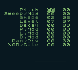
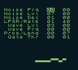
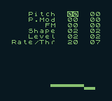
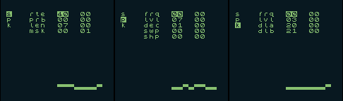

# Game Boy Synthesis and Sequencing

## Build


```
# Fix paths to your RGBDS suite in `common.mk`
# Build roms

$ make -C "01 rng"
$ make -C "02 nrn"
$ make -C "03 lin"
$ make -C "04 dnb"
```

### Run

```
$ make -C "01 rng" run
$ make -C "02 nrn" run
$ make -C "03 lin" run
$ make -C "04 dnb" run
```

## Intro

This is a series of experiments in audio programming for the Game Boy, exploring ideas of generative sound synthesis and sequencing in a limited environment while learning Game Boy assembler programming.

The heart of the most of sequencers is the 8-bit shift register, built upon the idea of the Rungler circuit by Rob Hordijk.

It uses the audio level of the Game Boy audio circuit for feeding and shifting.

One bit of this shift register is used for triggering the sound, and the numeric register value (possibly masked) is used for sound parameter modulation.

We can read these channels through the (undocumented) PCM12 and PCM34 registers, but these two registers are available only on the Game Boy Color, so the ROM will not function on the DMG as intended.

Not every emulator supports these registers (I found that some popular Android emulators ignore them).

## Controls

Most of the roms have the same control scheme:
- Left/Right/Down/Up: move cursor around the grid
- A + Left/Right: change the value under cursor by -1/+1
- A + Down/Up: change the value under cursor by -10/+10
- Select + Down/Up: change page (in `gbdnb.gb`)
- Start: Play/Pause (in `gbrng.gb` and `gblin.gb`)

## ROMs

### 01 rng / gbrng.gb

Uses two first pulse channels to control rungler and play sound.



```text
┌────────────────────┐
│                    │
│                    │
│     Pitch  00  00  │ Channels' pitches
│ Sweep/Mod  00  00  │ Channel 1 sweep and sweep modulation
│     Shape  02  02  │ Channels' shapes (pulse widths)
│     Level  07  07  │ Channels' level
│     Decay  00  00  │ Channels' envelope decay
│     P.Mod  00  00  │ Pitches' modulation
│     L.Mod  00  00  │ Levels' modulation
│     D.Mod  00  00  │ Decays' modulation
│   Pan/Div  00  30  │ Pan: split channels L/R, Div: tempo
│  XOR/Gate  00  00  │ Cryptic params to control sequencer behavior
│                    │
│                    │
│                    │
│         ________   │ Shift register visualization
│                    │
│                    │
└────────────────────┘
```

### 02 nrn / gbnrn.gb

Uses noise and wave channels to control the shift register and play sound.

This is messy because I tried to implement different wave synthesis algorithms: [Robert Henke's kick drum](https://roberthenke.com/technology/8bit-kick.html), [Risset drum](https://manual.audacityteam.org/man/risset_drum.html), [Karplus-Strong](https://en.wikipedia.org/wiki/Karplus%E2%80%93Strong_string_synthesis), and traces of unfinished implementations are scattered across the code. I also handle wave channel streaming in the wrong way, but whatever — it's part of the appeal.



```text
┌────────────────────┐
│                    │
│                    │
│ Noise Frq  00  00  │ Noise frequency and modulation amount
│ Noise Lvl  07  00  │ Noise level and modulation amount
│ Noise Dec  01  00  │ Noise decay and modulation amount
│ LFSR/Rate  01  40  │ 8/16 bit noise and sequencer tempo
│  Wave Lvl  03  00  │ Wave level and modulation amount
│  Wave Frq  00  00  │ Wave frequency and modulation amount
│ Prob/Leng  00  07  │ Shift register bit flip probability and length
│  Gate Thr  00  01  │ Cryptic parameters to trigger channels
│                    │
│                    │
│                    │
│                    │
│                    │
│         ________   │ Shift register visualization
│                    │
│                    │
└────────────────────┘
```


### 03 lin / gblin.gb

Something like a [Benjolin](https://afterlateraudio.com/products/benjolin-v2) — the shift register is fed from and modulates two pulse channels, FMing each other (no true FM on the Game Boy, of course), with pitch modulation, and that's mostly all.



```text
┌────────────────────┐
│                    │
│                    │
│     Pitch  00  00  │ Channels' pitches
│     P.Mod  00  00  │ Pitches' modulation amount
│        FM  00  00  │ FM amount: 1 -> 2, 2 -> 1
│     Shape  02  02  │ Pulse width
│     Level  02  02  │ Channels' levels
│  Rate/Thr  20  07  │ Tempo and some cryptic parameter for sequencer
│                    │
│                    │
│                    │
│                    │
│                    │
│                    │
│                    │
│         ________   │ Shift register visualization
│                    │
│                    │
└────────────────────┘
```

### 04 dnb / gbdnb.gb

Something similar to `gbnrn.gb` but cleaner, with several control pages,
with proper (more or less) wave channel streaming. `dnb` stands for `Drum and Bass` because first channel acts for drum (with pitch envelope) and for bass.
The wave channel plays a modified Karplus-Strong algorithm (if `dla` and `dlb` are one sample apart, it is the usual K-S). Sound has noticeable crackles because of wave channel retriggering.




#### Sequencer page

```
│                    │
│ S   rte  40  00    │ Sequencer rate and its modulation amount
│ p   prb  00  00    │ Bit flip probability and its modulation amount
│ k   len  07  00    │ Sequencer length and its modulation amount
│     msk  01  01    │ Channel trigger mask (defines pattern)
│                    │
│                    │
```

#### Pulse page

```
│                    │
│ s   frq  40  00    │ Pulse frequency and its modulation amount
│ P   lvl  00  00    │ Pulse level and its modulation amount
│ k   dec  07  00    │ Envelope decay and its modulation amount
│     swp  01  01    │ Pitch sweep and its modulation amount
│     shp  00  00    │ Pulse width and its modulation amount
│                    │
```

#### Synth page (**K**arplus-Strong)

```
│                    │
│ s   frq  00  00    │ Synth frequency and its modulation amount
│ p   lvl  03  00    │ Synth level and its modulation amount
│ K   dla  20  00    │ Envelope decay and its modulation amount
│     dlb  21  00    │ Envelope decay and its modulation amount
│                    │
│                    │
```
